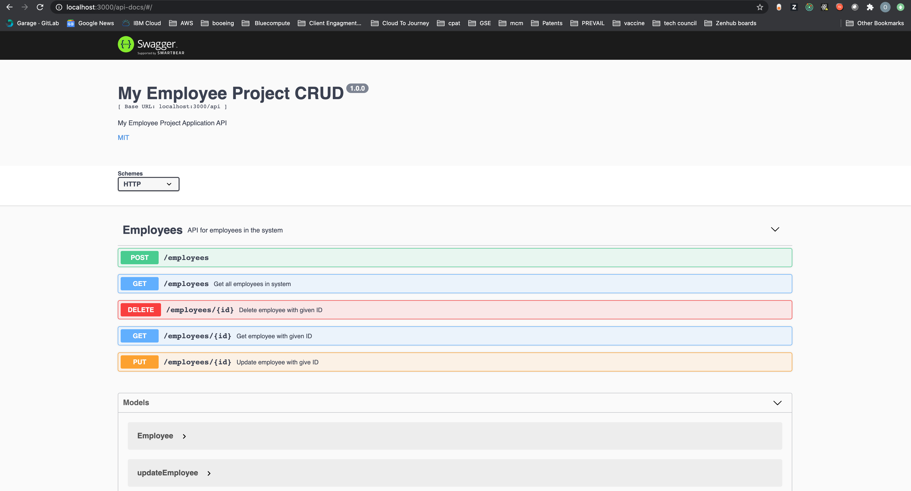

# Employee CRUD In NodeJS Express


## Build and run locally
```bash
npm install
npm start
```
Now go to `http://localhost:3000/api-docs`

## Expected Endpoints

POST http://localhost:3000/api/employees
```
curl -X POST "http://localhost:3000/api/employees" -H  "accept: application/json" -H  "Content-Type: application/json" -d "{  \"id\": 0,  \"firstName\": \"Blkjob\",  \"lastName\": \"Burgers\",  \"hireDate\": \"01/01/2020\",  \"role\": \"CEO\"}"
```

PUT http://localhost:3000/api/employees/:id
```
curl -X PUT "http://localhost:3000/api/employees/1" -H  "accept: application/json" -H  "Content-Type: application/json" -d "{  \"id\": \"1\",  \"firstName\": \"Lin\",  \"lastName\": \"Layfield\",  \"hireDate\": \"01/01/2020\",  \"role\": \"CFO\"}"
```

GET http://localhost:3000/api/employees/:id
```
curl -X GET "http://localhost:3000/api/employees/1" -H  "accept: application/json"
```

GET http://localhost:3000/api/employees
```
curl -X GET "http://localhost:3000/api/employees" -H  "accept: application/json"
```

DELETE http://localhost:3000/api/employees/:id
```
curl -X DELETE "http://localhost:3000/api/employees/1" -H  "accept: application/json"
```
